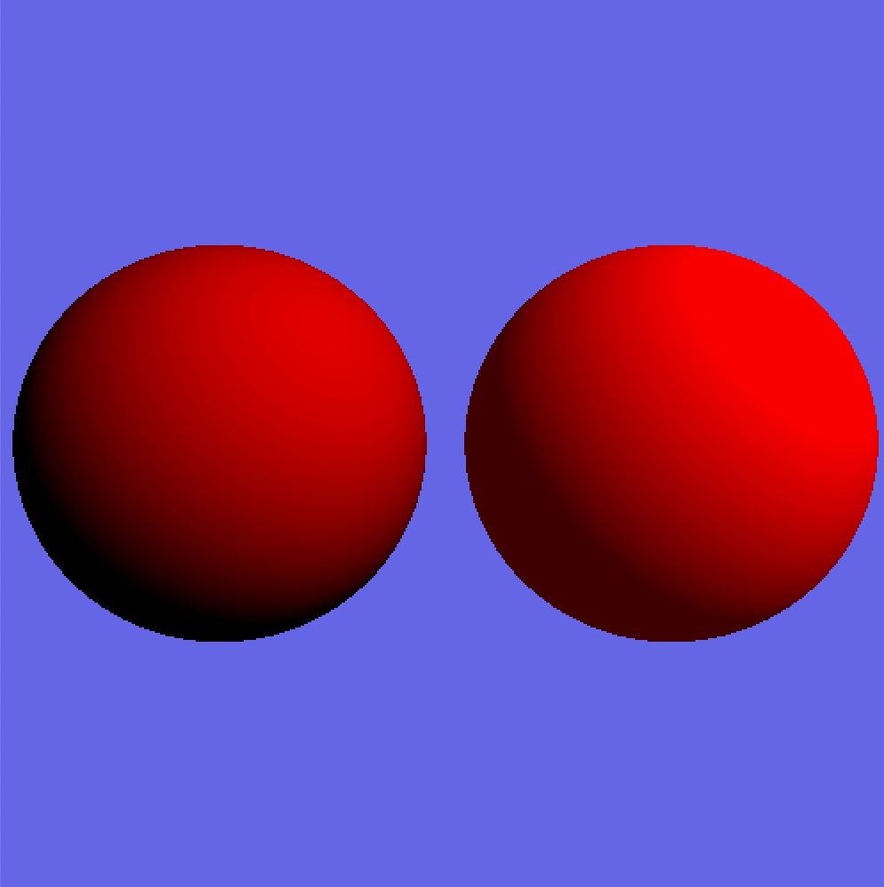
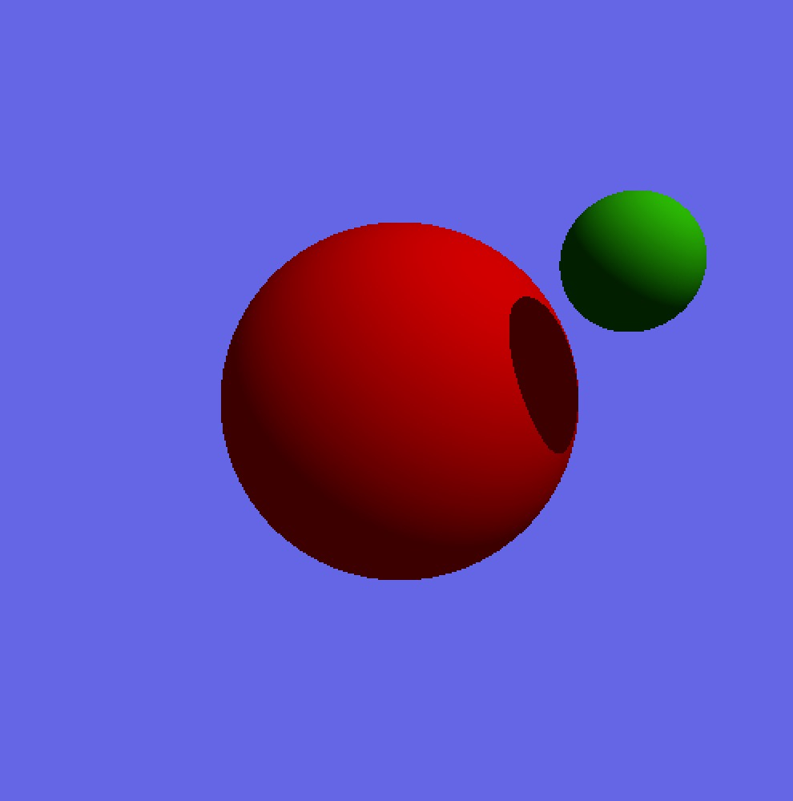
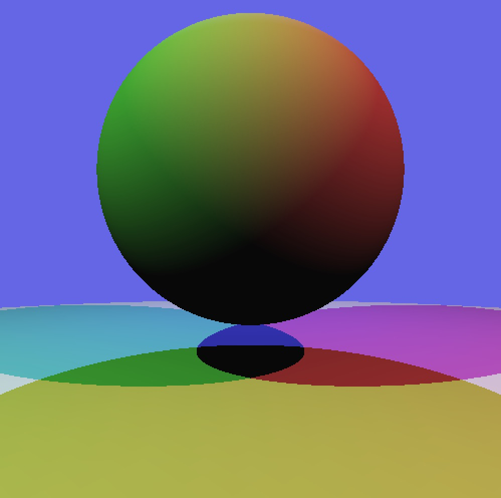

# Ray Tracer
 Ray tracer project developed using p5.js for computer graphics course
 
###  Features:
- Creating disks and spheres through ray intersection
- Distribution ray tracing for anti-aliasing and soft shadows
- Shadow creation (hard and soft shadows) with use of point and area lights
- Jittered sampling option for smoother and more gradual soft shadows

### Screenshots:
{:height="500px" width="500px"}
{:height="500px" width="500px"}
{:height="500px" width="500px"}
{:height="500px" width="500px"}